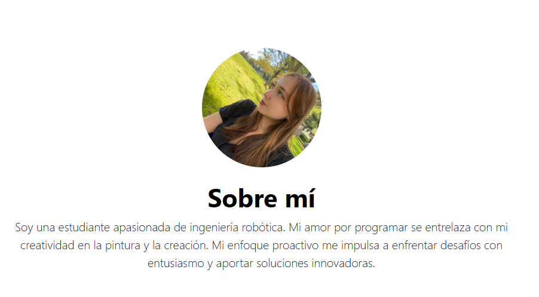

# Portafolio personal: Tecnolochicas PRO 

Este proyecto fue crado durante el bootcamp de Tecnolochicas PRO, es una página responsiva (adaptable a diversos dispositivos).
El propósito de la creación de este sitio web es mostrar el portafolio de proyectos de la desarrolladora y su experienca alrededor del área.

Incluye las secciones: sobre mí, proyectos, experiencia

Incluye recursos multimedia

<a href="https://verdant-puffpuff-9ff9bb.netlify.app/" target="_blank">Visitalo ahota </a>

## Índice 
1. Introducción
2. Demo 
3. ¿Qué construimos?
4. Objetivos de aprendizaje
5. Requerimientos

## Secciones (capturas de pantalla)
Sobre mí:

Sobre mí:

Sobre mí:

Sobre mí:

Sobre mí:

## Tecnologías
HTML
CSS
JavaScript

